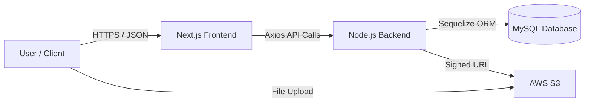
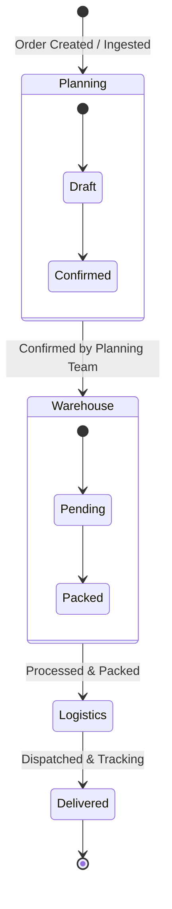
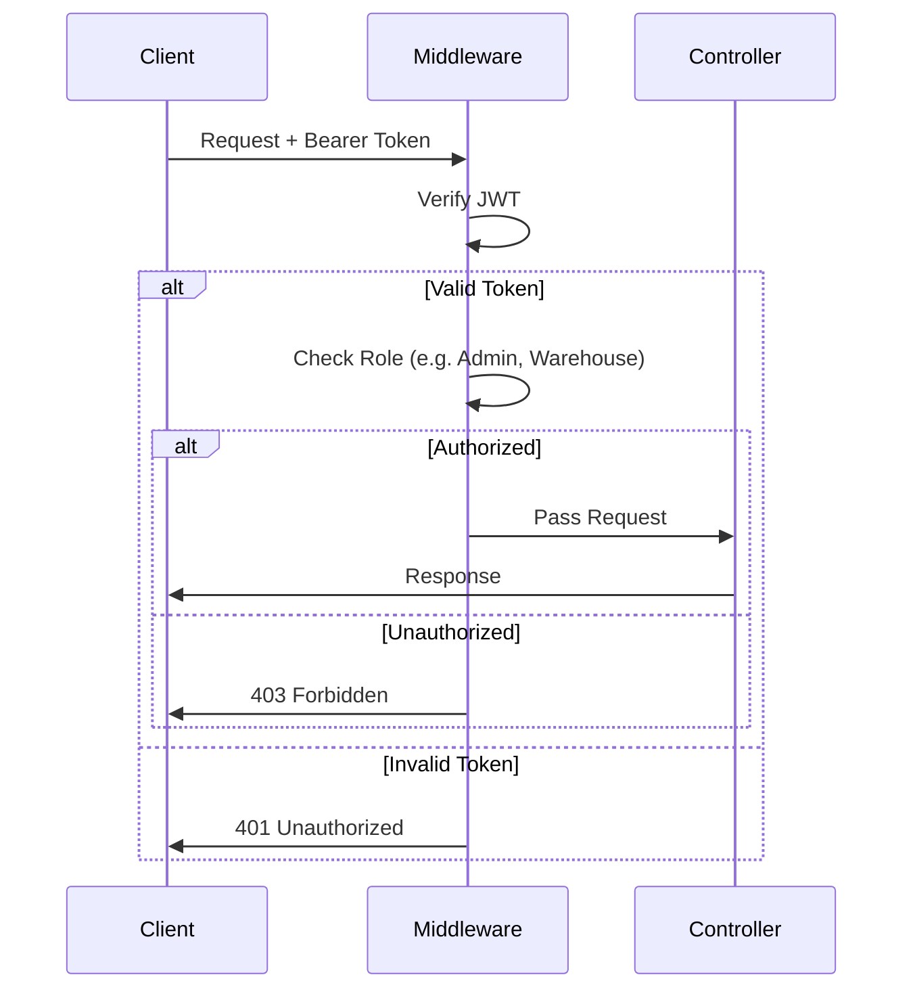

# Workflows & Data Flow

## High-Level Data Flow

## Shipment Lifecycle
The core of the CMS is managing Shipments through various stages.

## Role-Based Access Control (RBAC) Workflow
The backend enforces access control via Middleware.

## CSV Import/Export Process
1. **Import**: User uploads a file. The frontend requests a pre-signed S3 URL. User uploads directly to S3. Backend is notified to process the file from S3 (or direct payload if small).
2. **Export**: User requests download. Backend generates a CSV (often using streams or temporary files), uploads to S3, and returns a signed URL for the frontend to download.
